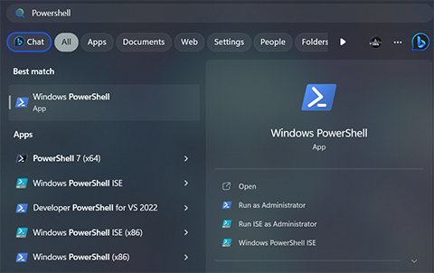
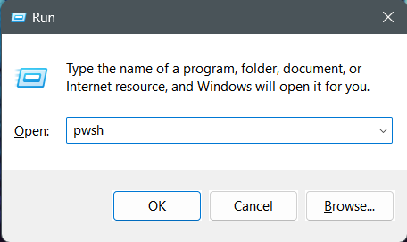
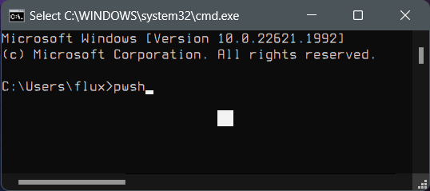
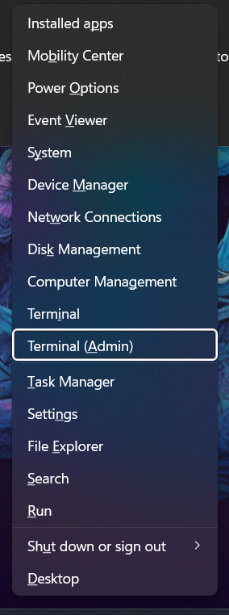
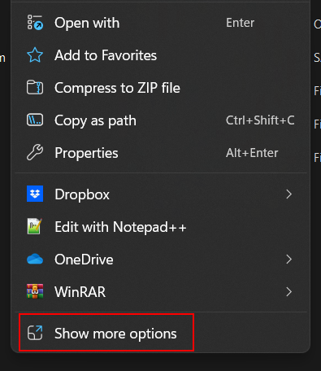
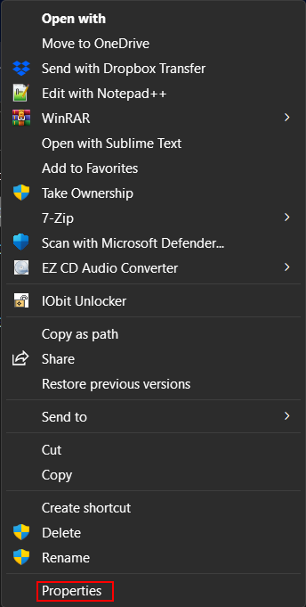
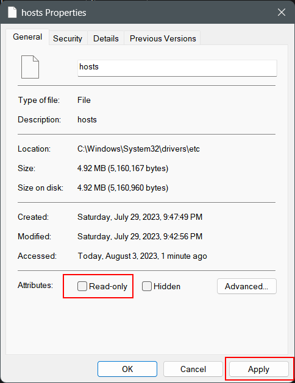
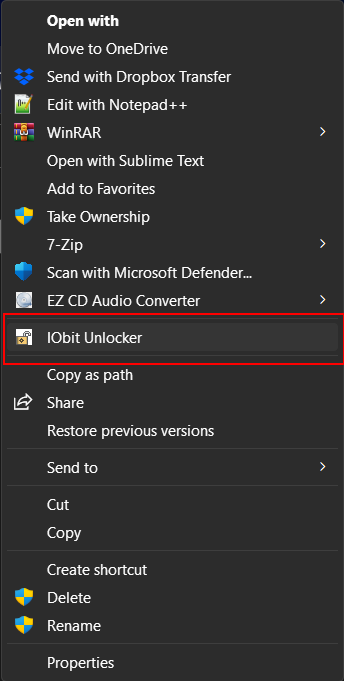
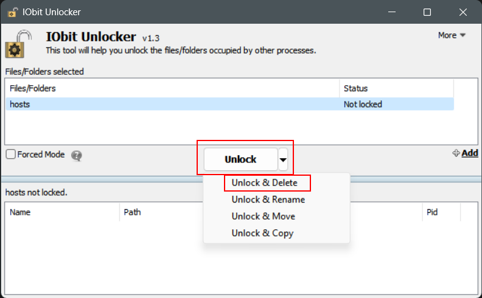

# Hosts Compression Scripts


---

<!-- ***This project is*** ![Under Construction](https://img.shields.io/static/v1?logo=data:image/png;base64,iVBORw0KGgoAAAANSUhEUgAAAA4AAAAOCAYAAAAfSC3RAAACmElEQVQokUWSa0iTcRTGn//26u4b6ZQ0U8lKMqykwPpgZVBEHyLp8jEoIZJADCQ0iCiStIwuZmHRioIuroQss2VkrkIrdeFckiZqdhctTXPOve8Tr7M6X8/zO+fwPEfIwy7IwQA0GgExGYQwyhCmMLRX1z2hJCJSN+xZgqAZnPgCaAUQ0EHICjSYLlKBCDdNQb7HLmeRoy3zQFnzYk/1WTckGUIXCVD+Kw+BpAxtuBXCpkN7bdXt/JL3W3J3xuHg3iTsL/NkNFWVPoWkQOj/wxooCrRhFgiTjI4n9ZVHHQObjxVEY8UGIi1zEhVFCahwdq5qvn+hHkKC0EcBigxwvAnkW3ge7L6TMi+VztOLOOKOY8ulKL68GM2emnjeLF3AZSlz2FCZ6yaHwLGv6pkv8MyxsUoHLcsLwBuHwE0rtdy2UuLWNTpmpkkszQEfnAPDAd47tbaB7NaJR+eXujfmtGTUXgFWp5uwPd8Oi1GBJEmwWYlP34L4PSFw7chPeD+MYnkWUVmy0CeNfe5N8ANIjNWpNmHzqklYrDIGRwRm2gXsM/xofRMOf1AgcbYOAfgxMvgxCmS9+dbh5A6VarxuIMdBDoJ0g+vSreytNpAEux7qqWrK82I+kC2xYOAzyFbz5QNJPrXhdRo4XK/n3WILkxPsbKqwsr8xBB3PjukhGyJJv+qqB+QvkN0mR2Fim5pU1hobzxTYOPbcyJoTNpoAlu6wdZKvIslR0O9VXe0Clc5p2Ge4WDh36ux3ThM/1RqnNhXvilU32cjvINtAf4cKdkzlSHpBTqgNY11JfLtFA+o14NU8Wx/piggNfg2yGVR8EF9/dP37PyCIoDQLs8z9hmv71nsC4wFz9klX2tD4/AEG+gBoQ7KghD8MZ2xdnt7s7wAAAABJRU5ErkJggg==&label=Under&message=Construction&style=for-the-badge&labelColor=1D1D1D&color=ffff99) -->

- [Hosts Compression Scripts](#hosts-compression-scripts)
  - [About](#about)
    - [Description](#description)
    - [Motivation](#motivation)
  - [TODO](#todo)
  - [Usage](#usage)
  - [Guides And Examples](#guides-and-examples)
    - [Compressing Windows](#compressing-windows)
      - [PowerShell Compression - Steven Black's](#powershell-compression---steven-blacks)
    - [Replacing Windows Hosts File](#replacing-windows-hosts-file)
    - [Compressing Linux](#compressing-linux)
      - [Bash Compression - Universal](#bash-compression---universal)
    - [Replacing Linux Hosts File](#replacing-linux-hosts-file)
  - [Project Information](#project-information)
    - [Source File Quality](#source-file-quality)
    - [File MD5 Hashes](#file-md5-hashes)
      - [Current Windows Black Hosts PowerShell Script](#current-windows-black-hosts-powershell-script)
      - [Current Linux Universal Hosts Bash Compression Script](#current-linux-universal-hosts-bash-compression-script)
    - [Other Miscellaneous File Information](#other-miscellaneous-file-information)
  - [Notes](#notes)
    - [Note 1](#note-1)
    - [Note 2](#note-2)
    - [Note 3](#note-3)
  - [Contribute](#contribute)
  - [Support Me If You Like](#support-me-if-you-like)
  - [LICENSE](#license)

---

## About

***NOTICE***: ***The universal PowerShell script is complete and will be coming very soon. This script should be able to replace the Steven Black's version completely, but I will keep it here for archival reasons.***

Scripts to compress the hosts file in various operating systems.

 ***DISCLAIMER*** - The current PowerShell script here is only for the main Steven Black *HOSTS* file. I will be writing a more universal PowerShell script soon. At the time of development I was not planning any public release and it was for me alone. Coming soon.

### Description

 Here you will find *scripts* I've written (eventually programs) to help compress the hosts file found in various operating systems. The very first script provided here is a PowerShell script specifically for the main hosts file found at [Steven Black's repository](https://github.com/StevenBlack/hosts), but I will add more gradually. The Steven Black version has been written specifically to be able to keep all content in the file just rearranging it. To be able to write more of it for the rest of his files I need to study the other versions of his files to find the best delimiters for parsing. I will work on the universal PowerShell script next to have a more universal version, but it more than likely will discard all extra text and only keep the URLS and discard any extra text.

 The *hosts*<sup>[[1](#note-1)]</sup> file is a text file in all (that I know of) operating systems that maps hostnames[[2](#note-2)]</sup> (google.com for example) to ip addresses[[3](#note-3)]</sup> (0.0.0.0 or 127.0.0.1 for examples) and they can become very large if you use a custom one (especially a consolidated one such as one of [Steven Black's](https://github.com/StevenBlack/hosts)). In *Linux* the file's size is not much of an issue, but in Windows (especially) this can slow down DNS caching and therefore cause internet/application issues such as slowing down the internet/external network or even bringing the internet to a halt. A way to circumvent this issue is to *compress* (or aggregate) multiple host names into single lines (or disable the DNS Client, which I definitely do not recommend for various reasons (and especially if you use WSL)). Windows can handle 9 hostnames per line; for example:

 ```
 0.0.0.0 fakename_1.url fakename_2.url fakename_3.url fakename_4.url fakename_5.url fakename_6.url fakename_7.url fakename_8.url fakename_9.url
 ```

 whereas Linux has no limit (that I know of; I have tested 10000 names on a single line).

 Therefore it's a great idea to compress larges hosts files, especially in Windows and one can do so with scripts found here. My last compression turned 189k+ hostnames into 21k+ lines and went from an hour plus of no internet after boot to instantaneous internet.

 NOTE 1: There's a misconception that the host's file size matters (some people say over 1MB is problematic) and it really doesn't. It's more about the number or URLS per IP line. For example; a file size of 6MB+ compresses down to 5MB and runs exponentially better to near unnoticeable. 

### Motivation

A need to use a large hosts file in Windows and actually have access to the internet.

---

## TODO

Please bear with me as this is a lot of work and I am a busy man, but in my opinion the most important script is ready and usable.

  - [ ] Scripts
    - [ ] Windows
      - [x] Create PowerShell script - Steven Black's
      - [ ] Create PowerShell script - Universal
      - [ ] Create CMD script - Steven Black's
      - [ ] Create CMD script - Universal
      - [ ] Create AutoHotkey script/compiled executable for both.
    - [ ] Linux
      - [x] Create Bash script - Universal
      - [ ] Create POSIX shell script - Universal
    - [ ] MacOS
      - [ ] Probably not, we'll see
    - [ ] Cross Platform
      - [ ] Create Python script  
- [ ] Programs
  - [ ] Create C++ program
  - [ ] Create (maybe) Rust program 

## Usage

For now these are all command line tools, whether they be a script or binary executable. No immediate plans for GUIs, but that make eventually change.

The main focus for now is Windows and Linux, but as stated in the [Motivation](#motivation) section the whole reasons I started this is for the shipwreck that is the Windows environment. I love Windows and Linux, but to deny there are some issues in Windows (in both really, but most notably Windows) is folly.

## Guides And Examples

Here you will find guides for Windows and Linux as these are my primary environments for which I have the most knowledge. If you care to contribute a MacOS or any other script and/or other guides (or anything else) please feel free to [fork](https://github.com/Lateralus138/hosts-compression-scripts/fork) and make a *pull request*.

These guides are not for use with the PiHole or adblockers, they are specifically for hosts found in the default directories such as:

Windows:

```C:\Windows\System32\drivers\etc\hosts```

and Linux:

```/etc/hosts```

I'll not give specific instructions on editing or installing the hosts file, if you need to compress yours you've probably already passed that point, but, of course, you can look it up yourself and here's a starting point if you like via *DuckDuckGo*:

[How to edit the hosts file @ DDG](https://duckduckgo.com/?q=How+to+edit+the+hosts+file&ia=web)

More will be added as I write more scripts. These guide assume you have already replaced or altered your hosts file. These scripts do not edit the file in place (for now) and only prints the output to the console by default.

### Compressing Windows

The Windows hosts file located at ```C:\Windows\System32\drivers\etc\hosts```

#### PowerShell Compression - Steven Black's

NOTE 1: This will eventually be replaced by a more universal generic script. I originally started this project with Steven's main hosts file in mind and so that's where my head was at at the time and writing a more universal script might be a bit more work (maybe not though, we'll see).

NOTE 2: This script could take some time depending on your machine. Reason 1 being that this is a shell script and though PowerShell has come a long way it can't compare to a compiled binary (in C/C++ for example). Reason 2 being you are parsing hundreds of thousands (more or less) of URLS! If you weren't then you wouldn't need this script. 

This assumes you have already installed a custom hosts file from Mr. Black's repository and it is located in the appropriate directory as stated above.

1. Download ```compress_steven_black_hosts.ps1``` from the current [Releases Page](https://github.com/Lateralus138/hosts-compression-scripts/releases) and place it anywhere you like. 
2. Open a PowerShell terminal from the Start Menu, Run (Win+r), or from CMD (powershell or pwsh).



2. Change directory to the location of the PS1 script you downloaded from here; you don't have to, but if you don't you must provide the path to the full script (for example C:\Path\To\ScriptLocation\script.ps1). For example:
```PowerShell
 PS> cd C:\Users\<USERNAME>\Downloads
```
3. It's possible that executing PowerShell scripts is disabled by default on your Windows machine. If so then enable it. You'll need to run this next command as Administrator in an Administrative PowerShell instance:
      - You can either Right Click->Run as administrator from the Start Menu or use the hotkey ```Win+x``` and either press 'a' or click the options from the menu.
    
    
      - From the administrative PowerShell instance type `Set-ExecutionPolicy unrestricted` and hit [Enter].
      ```Powershell
       PS> Set-ExecutionPolicy unrestricted
      ```
4. If you only want to see the compressed results from the command line then (from the directory of the script, unless you want to type the full path) type `.\compress_steven_black_hosts.ps1` and it will somewhat verbosely run through the process of compression and output the results to the screen.
```
 PS> .\compress_steven_black_hosts.ps1
```
5. To actually output the compressed results to a file run the same command, but redirect the output to a file: `compress_steven_black_hosts.ps1 -File hosts`. I do not recommend overwriting the original file (as this is harder to do and I provide a more reliable method below in [Replacing Windows hosts file](#replacing-windows-hosts-file)).
```
 PS> .\compress_steven_black_hosts.ps1 -File hosts
```

You will now have a new compressed version of Steven Black's hosts file. All of the original content of the file will be there, but reordered. As some of the comments (#[Added]... for example) were mixed in with the original URLS they will now be placed at the bottom and make no sense. The other text (header and footer) in the original file will still be in their appropriate places.

### Replacing Windows Hosts File

Replacing the Windows hosts file can be a pain as it is almost always "in use by another program", but there are at least 2 ways it can be done with ease (either by using a Linux to do it or by force deleting with an external program). Here I will only explain how to do it natively using an external program to force delete the file and replacing it with the new one. I will not explain how to use Linux to do it as anyone who knows how to dual boot or use a live distro to access Windows more than likely doesn't need an explanation and here that is more work than is necessary.

As with working with, editing, or replacing any file (especially a system file) I recommend making a backup of the file you are replacing. You can do this by copying and pasting the file from one place to another (or the same place really, but I'd recommend backing up to your Documents or Desktop folder or somewhere you know you'll find it). Here I will show how to do things by a gui first and foremost, but somethings can not be done so (flushing the DNS).

As stated above the Windows hosts file is located at `C:\Windows\System32\drivers\etc\hosts`

1. [Optional] Backup your original hosts file.
2. [Possibly Optional] If the file is set to read only (not usually, but mine is and I know some security software has been known to set the hosts file to read only) then you must set the file to writable. To do so right click on the hosts file and choose 'Properties' (newer versions of Windows it might be Right Click->Show More Options->Properties) or simply by pressing [Alt+Enter] while the file is selected and then uncheck the 'Read Only' check box at the bottom of the 'General' tab ad press [Apply]:





3. [Possibly Optional] Often your hosts file is in use (by *svchost.exe*) and if you try to replace or delete the file it won't let you. The best option is to use an unlocker program to unlock and delete the file. If you attempt to only unlock the file and then try to delete it manually it more than likely will be locked again so it's best to use the 'Unlock and Delete' option. I highly recommend [IOBit's Unlocker](https://www.iobit.com/en/iobit-unlocker.php) which is a completely free application and I have used it for years WITHOUT FAIL, but, of course, you can search for your own as there are several options (here's a head start if you like: [file unlocker programs @ DDG](https://duckduckgo.com/?q=file+unlocker+programs&ia=web)). With IObit unlocker you would right click on the hosts file (and possibly "Show More Options") and choose the 'IOBit Unlocker' option and when the program starts select "Unlock & Delete".




4. Flush the DNS. This is the only option that must be done from the command line and can be done in CMD or PowerShell. It's best to do this option before replacing the hosts file with the new one as when you place the new hosts file it might be in use and flushing won't be possible while it's in use. Start your terminal up and run the following command and press [Enter]:
```PowerShell
PS> ipconfig /flushdns
```

5. Copy and paste the new *hosts* file to the `etc` directory where you just deleted the original file.
6. [Somewhat Optional] Reboot your system. You can wait to do this, but it's possible that not all services and applications that utilize the hosts file/DNS caching will utilize the new changes until reboot.

### Compressing Linux

The *Linux* hosts file is located at `/etc/hosts`.

#### Bash Compression - Universal

This assumes you have already installed a custom hosts file or have altered it yourself. Unlike Windows this method is much easier (of course).

There are two modes; you can just view the compressed result (default) in the terminal or output the compressed result to a file. 

1. Download ```compress_linux_generic_hosts.bash``` from the current [Releases Page](https://github.com/Lateralus138/hosts-compression-scripts/releases) and place it anywhere you like.
2. Open a *Bash* shell in the terminal of your choice and navigate to the directory where the script is located (not necessary, but you if you don't then you must provide the full path).
3. You may need to set the permissions of the script to executable. This can be done in a few ways using `chmod`.
   - Set the file to executable for the current user only:
   ```Bash
    $ chmod u+x /path/to/compress_linux_generic_hosts.bash
   ```
   - Set the file to executable for everyone:
    ```Bash
    $ chmod +x /path/to/compress_linux_generic_hosts.bash
    # or
    $ chmod 0755 /path/to/compress_linux_generic_hosts.bash
    ```
4. [Default Output] To see the resulting compressed output:
   ```Bash
    $ ./compress_linux_generic_hosts.bash
   ```
5. [File Output] Output the compressed result to a file. You can either make a different file or overwrite the original, but if you overwrite you must use `sudo`:
   - To a new file
    ```Bash
     $ ./compress_linux_generic_hosts.bash hosts
     # or
     $ ./compress_linux_generic_hosts.bash /path/to/new/hosts
    ```
    - Overwrite `/etc/hosts`
    ```Bash
     $ sudo ./compress_linux_generic_hosts.bash /etc/hosts
    ```
### Replacing Linux Hosts File

Unlike Windows this is simple and only necessary if you didn't use the overwrite method:

1. Copy the file to the new file to `/etc/hosts` using `sudo`.
   ```Bash
    $ sudo cp /path/to/new/hosts /etc/hosts
   ```
2. [Optional] You may want to flush the DNS cache, but it's not usually necessary. I won't go in-depth here, but one possible way is to use `resolvectl flush-caches`.
   ```Bash
    $ resolvectl flush-caches
   ```

## Project Information

<!-- &#x54;&#x68;&#x69;&#x73;&#x20;&#x70;&#x72;&#x6f;&#x6a;&#x65;&#x63;&#x74;&#x20;&#x69;&#x73;&#x20;&#x77;&#x72;&#x69;&#x74;&#x74;&#x65;&#x6e;&#x20;&#x69;&#x6e;&#x20;`C++`.

[![C++](https://img.shields.io/endpoint?url=https://raw.githubusercontent.com/Lateralus138/hosts-compression-scripts/master/docs/json/cpp.json&logo=data%3Aimage%2Fpng%3Bbase64%2CiVBORw0KGgoAAAANSUhEUgAAABAAAAAQCAMAAAAoLQ9TAAAABGdBTUEAALGPC%2FxhBQAAACBjSFJNAAB6JgAAgIQAAPoAAACA6AAAdTAAAOpgAAA6mAAAF3CculE8AAABcVBMVEUAAAAAgM0Af8wolNQAa7YAbbkAQIcAQIYAVJ0AgM0AgM0AgM0AgM0AgM0AgM0AgM0AgM0AgM0AgM0Af8wAfswAfswAf8wAgM0AgM0AgM0Af80AgM0AgM0AgM0AgM0Af8wAgM0Af80djtIIg84Af8wAfsxYrN4Fg84Gg85RqNwej9MLhM8LhM8AfcsAgM0Hg88AfsshkNNTqd1%2Fv%2BUXi9AHdsAAYKoAY64ih8kAf81YkcEFV54GV55Sj8EnlNULhc8AecYdebwKcrsAe8gAb7oAXacAXqgAcLwAImUAUpoAVJ0AUpwAUZoAIWMAVJ0AVJ0AUpwAUZwAVJ0AVJ0AVJ0AVJ0AgM0cjtJqteGczetqtOEAf807ndjL5fT9%2Fv7%2F%2F%2F%2FM5fQ9ntnu9vu12vCi0Oz%2F%2F%2F6Hw%2Bebzeufz%2Bx%2Bv%2BW12e%2Bgz%2BxqteLu9fmRx%2BjL3Ovu8%2Fi1zeKrzeUAUpw7e7M8fLQAU50cZ6hqm8WcvNgAVJ3xWY3ZAAAAVnRSTlMAAAAAAAAAAAAREApTvrxRCQQ9rfX0qwErleyUKjncOFv%2B%2Fv5b%2Ff7%2B%2Fv7%2B%2Fv1b%2Ff7%2B%2Fv7%2BW%2F7%2B%2Fv79%2Fv7%2B%2Fv7%2B%2Fv7%2B%2Fjfa2jcBKJHqKAEEO6r0CVC8EFaOox4AAAABYktHRF9z0VEtAAAACXBIWXMAAA7DAAAOwwHHb6hkAAAAB3RJTUUH5QYKDQws%2FBWF6QAAAONJREFUGNNjYAABRkZOLkZGBhhgZOTm4eXjF4AJMQoKCYuEhYmKCQmCRBjFJSSlwiMiI6PCpaRlxBkZGGXlomNi4%2BLj4xISo%2BXkgQIKikqx8UnJyUnxKcqKKiAB1ajUJDV1Dc00LW0dXSaggF56fLK%2BgYFhhlGmsQkzRCDL1MzcIhsmYJkTn2tlbWObZ2cP0sKk4OCYH19QWFgQX%2BTkrMLEwOLiWlySD7I2v7TMzZ2Vgc3D08u7vKKysqLc28vHlx3oVg4%2F%2F4DAqqrAAH8%2FDohnODiCgkNCgoM4OOD%2B5eAIDYVyAZ9mMF8DmkLwAAAAJXRFWHRkYXRlOmNyZWF0ZQAyMDIxLTA2LTEwVDE4OjEyOjQ0LTA1OjAwkjvGQgAAACV0RVh0ZGF0ZTptb2RpZnkAMjAyMS0wNi0xMFQxODoxMjo0NC0wNTowMONmfv4AAAAASUVORK5CYII%3D)](http://www.cplusplus.org/) -->

### Source File Quality

&#x54;&#x68;&#x69;&#x73;&#x20;&#x69;&#x73;&#x20;&#x67;&#x72;&#x61;&#x64;&#x65;&#x64;&#x20;&#x62;&#x79;&#x20;&#x43;&#x6f;&#x64;&#x65;&#x46;&#x61;&#x63;&#x74;&#x6f;&#x72;&#x20;&#x61;&#x6e;&#x64;&#x20;&#x69;&#x73;&#x20;&#x73;&#x75;&#x62;&#x6a;&#x65;&#x63;&#x74;&#x69;&#x76;&#x65;&#x2c;&#x20;&#x62;&#x75;&#x74;&#x20;&#x68;&#x65;&#x6c;&#x70;&#x73;&#x20;&#x6d;&#x65;&#x20;&#x74;&#x6f;&#x20;&#x72;&#x65;&#x66;&#x61;&#x63;&#x74;&#x6f;&#x72;&#x20;&#x6d;&#x79;&#x20;&#x77;&#x6f;&#x72;&#x6b;&#x2e;

|                                                Name                                                 |                                                                        Status                                                                        |
| :-------------------------------------------------------------------------------------------------: | :--------------------------------------------------------------------------------------------------------------------------------------------------: |
| [codefactor.io](https://www.codefactor.io/repository/github/lateralus138/hosts-compression-scripts) |  |

### File MD5 Hashes

&#x41;&#x6c;&#x6c;&#x20;&#x68;&#x61;&#x73;&#x68;&#x65;&#x73;&#x20;&#x61;&#x72;&#x65;&#x20;&#x72;&#x65;&#x74;&#x72;&#x69;&#x65;&#x76;&#x65;&#x64;&#x20;&#x61;&#x74;&#x20;&#x63;&#x6f;&#x6d;&#x70;&#x69;&#x6c;&#x65;&#x2f;&#x62;&#x75;&#x69;&#x6c;&#x64;&#x20;&#x74;&#x69;&#x6d;&#x65;&#x2e;

#### Current Windows Black Hosts PowerShell Script


#### Current Linux Universal Hosts Bash Compression Script


### Other Miscellaneous File Information

|           Description            |                                                                                Status                                                                                |
| :------------------------------: | :------------------------------------------------------------------------------------------------------------------------------------------------------------------: |
|       Project Release Date       |          |
| Total downloads for this project |       |
|     Complete repository size     |                  |
|      Commits in last month       |  |
|       Commits in last year       |  |

## Notes

### Note 1

[What is the hosts file @ DDG](https://duckduckgo.com/?q=what+is+the+hosts+file&t=h_&ia=web)

### Note 2

What is a hostname

[What is a hostname @ DDG](https://duckduckgo.com/?q=What+is+a+hostname&t=h_&ia=web)

### Note 3

[What is an IP address @ DDG](https://duckduckgo.com/?q=What+is+an+IP+address&t=h_&ia=web)

---

## Contribute

Please feel free to contribute by `forking and making a *pull request*.

[](https://github.com/Lateralus138/hosts-compression-scripts/fork)

---

## Support Me If You Like

&#x49;&#x66;&#x20;&#x79;&#x6f;&#x75;&#x20;&#x6c;&#x69;&#x6b;&#x65;&#x20;&#x61;&#x6e;&#x79;&#x20;&#x6f;&#x66;&#x20;&#x74;&#x68;&#x65;&#x20;&#x70;&#x72;&#x6f;&#x6a;&#x65;&#x63;&#x74;&#x73;&#x20;&#x62;&#x65;&#x6c;&#x6f;&#x77;&#x20;&#x61;&#x6e;&#x64;&#x20;&#x63;&#x61;&#x72;&#x65;&#x20;&#x74;&#x6f;&#x20;&#x64;&#x6f;&#x6e;&#x61;&#x74;&#x65;&#x20;&#x74;&#x6f;&#x20;&#x6d;&#x79;&#x20;***PayPal***&#x3a;

[](https://paypal.me/ianapride?locale.x=en_US)

&#x4f;&#x72;&#x20;***Buy Me A Coffee***&#x20;&#x69;&#x66;&#x20;&#x79;&#x6f;&#x75;&#x72;&#x20;&#x70;&#x72;&#x65;&#x66;&#x65;&#x72;&#x3a;

[](https://www.buymeacoffee.com/ianalanpride)

---

## [LICENSE](./LICENSE)


<details>
  <summary>&#x4C;&#x69;&#x63;&#x65;&#x6E;&#x73;&#x65;&#x20;&#x45;&#x78;&#x63;&#x65;&#x72;&#x70;&#x74;</summary>
  <br>
  <blockquote>
  &#x20;&#x54;&#x68;&#x69;&#x73;&#x20;&#x70;&#x72;&#x6F;&#x67;&#x72;&#x61;&#x6D;&#x20;&#x69;&#x73;&#x20;&#x66;&#x72;&#x65;&#x65;&#x20;&#x73;&#x6F;&#x66;&#x74;&#x77;&#x61;&#x72;&#x65;&colon;&#x20;&#x79;&#x6F;&#x75;&#x20;&#x63;&#x61;&#x6E;&#x20;&#x72;&#x65;&#x64;&#x69;&#x73;&#x74;&#x72;&#x69;&#x62;&#x75;&#x74;&#x65;&#x20;&#x69;&#x74;&#x20;&#x61;&#x6E;&#x64;&sol;&#x6F;&#x72;&#x20;&#x6D;&#x6F;&#x64;&#x69;&#x66;&#x79;&#x20;&#x69;&#x74;&#x20;&#x75;&#x6E;&#x64;&#x65;&#x72;&#x20;&#x74;&#x68;&#x65;&#x20;&#x74;&#x65;&#x72;&#x6D;&#x73;&#x20;&#x6F;&#x66;&#x20;&#x74;&#x68;&#x65;&#x20;&#x47;&#x4E;&#x55;&#x20;&#x47;&#x65;&#x6E;&#x65;&#x72;&#x61;&#x6C;&#x20;&#x50;&#x75;&#x62;&#x6C;&#x69;&#x63;&#x20;&#x4C;&#x69;&#x63;&#x65;&#x6E;&#x73;&#x65;&#x20;&#x61;&#x73;&#x20;&#x70;&#x75;&#x62;&#x6C;&#x69;&#x73;&#x68;&#x65;&#x64;&#x20;&#x62;&#x79;&#x20;&#x74;&#x68;&#x65;&#x20;&#x46;&#x72;&#x65;&#x65;&#x20;&#x53;&#x6F;&#x66;&#x74;&#x77;&#x61;&#x72;&#x65;&#x20;&#x46;&#x6F;&#x75;&#x6E;&#x64;&#x61;&#x74;&#x69;&#x6F;&#x6E;&comma;&#x20;&#x65;&#x69;&#x74;&#x68;&#x65;&#x72;&#x20;&#x76;&#x65;&#x72;&#x73;&#x69;&#x6F;&#x6E;&#x20;&#x33;&#x20;&#x6F;&#x66;&#x20;&#x74;&#x68;&#x65;&#x20;&#x4C;&#x69;&#x63;&#x65;&#x6E;&#x73;&#x65;&comma;&#x20;&#x6F;&#x72;&#x20;&lpar;&#x61;&#x74;&#x20;&#x79;&#x6F;&#x75;&#x72;&#x20;&#x6F;&#x70;&#x74;&#x69;&#x6F;&#x6E;&rpar;&#x20;&#x61;&#x6E;&#x79;&#x20;&#x6C;&#x61;&#x74;&#x65;&#x72;&#x20;&#x76;&#x65;&#x72;&#x73;&#x69;&#x6F;&#x6E;&period;
  </blockquote>
  <br>
  <blockquote>
  &#x54;&#x68;&#x69;&#x73;&#x20;&#x70;&#x72;&#x6F;&#x67;&#x72;&#x61;&#x6D;&#x20;&#x69;&#x73;&#x20;&#x64;&#x69;&#x73;&#x74;&#x72;&#x69;&#x62;&#x75;&#x74;&#x65;&#x64;&#x20;&#x69;&#x6E;&#x20;&#x74;&#x68;&#x65;&#x20;&#x68;&#x6F;&#x70;&#x65;&#x20;&#x74;&#x68;&#x61;&#x74;&#x20;&#x69;&#x74;&#x20;&#x77;&#x69;&#x6C;&#x6C;&#x20;&#x62;&#x65;&#x20;&#x75;&#x73;&#x65;&#x66;&#x75;&#x6C;&comma;&#x20;&#x62;&#x75;&#x74;&#x20;&#x57;&#x49;&#x54;&#x48;&#x4F;&#x55;&#x54;&#x20;&#x41;&#x4E;&#x59;&#x20;&#x57;&#x41;&#x52;&#x52;&#x41;&#x4E;&#x54;&#x59;&semi;&#x20;&#x77;&#x69;&#x74;&#x68;&#x6F;&#x75;&#x74;&#x20;&#x65;&#x76;&#x65;&#x6E;&#x20;&#x74;&#x68;&#x65;&#x20;&#x69;&#x6D;&#x70;&#x6C;&#x69;&#x65;&#x64;&#x20;&#x77;&#x61;&#x72;&#x72;&#x61;&#x6E;&#x74;&#x79;&#x20;&#x6F;&#x66;&#x20;&#x4D;&#x45;&#x52;&#x43;&#x48;&#x41;&#x4E;&#x54;&#x41;&#x42;&#x49;&#x4C;&#x49;&#x54;&#x59;&#x20;&#x6F;&#x72;&#x20;&#x46;&#x49;&#x54;&#x4E;&#x45;&#x53;&#x53;&#x20;&#x46;&#x4F;&#x52;&#x20;&#x41;&#x20;&#x50;&#x41;&#x52;&#x54;&#x49;&#x43;&#x55;&#x4C;&#x41;&#x52;&#x20;&#x50;&#x55;&#x52;&#x50;&#x4F;&#x53;&#x45;&period;&#x20;&#x20;&#x53;&#x65;&#x65;&#x20;&#x74;&#x68;&#x65;&#x20;&#x47;&#x4E;&#x55;&#x20;&#x47;&#x65;&#x6E;&#x65;&#x72;&#x61;&#x6C;&#x20;&#x50;&#x75;&#x62;&#x6C;&#x69;&#x63;&#x20;&#x4C;&#x69;&#x63;&#x65;&#x6E;&#x73;&#x65;&#x20;&#x66;&#x6F;&#x72;&#x20;&#x6D;&#x6F;&#x72;&#x65;&#x20;&#x64;&#x65;&#x74;&#x61;&#x69;&#x6C;&#x73;&period;
  </blockquote>
</details>
